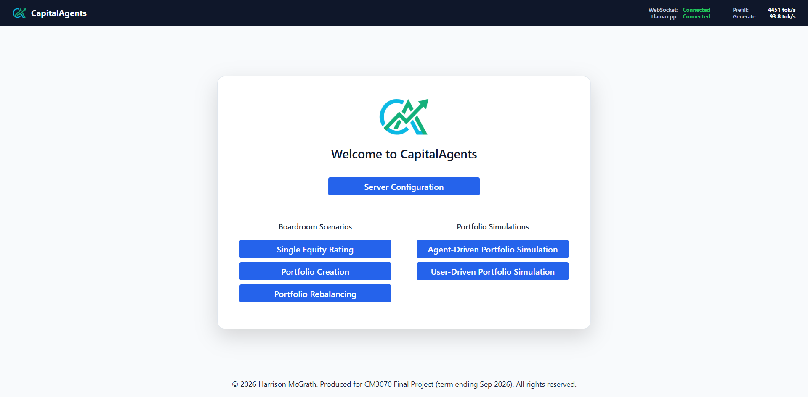
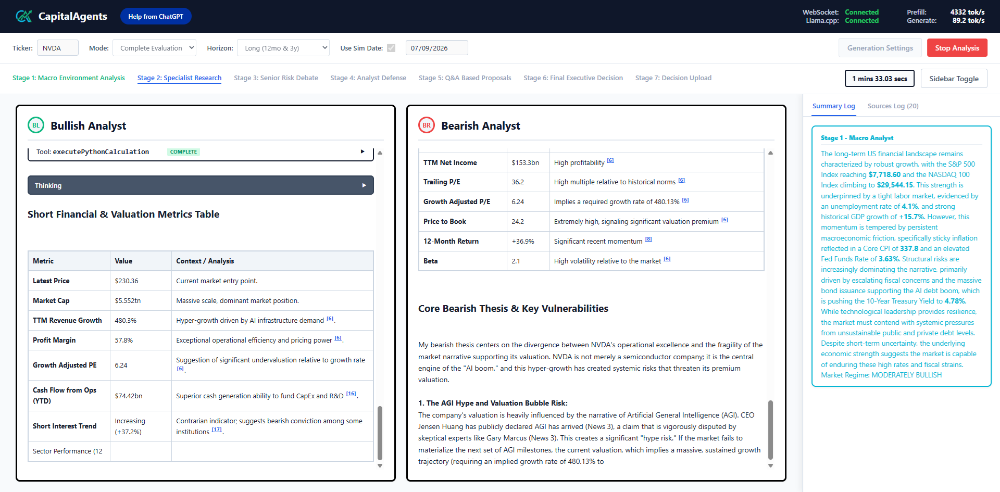
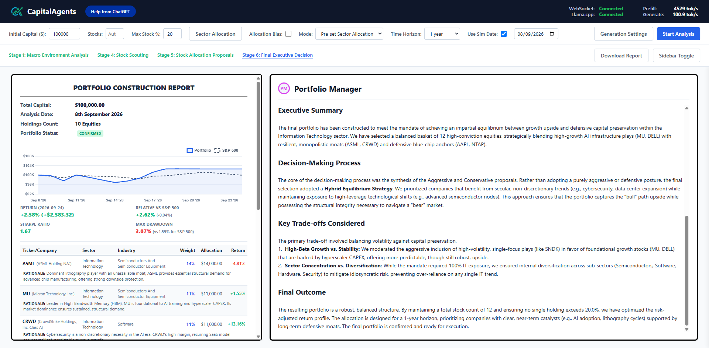
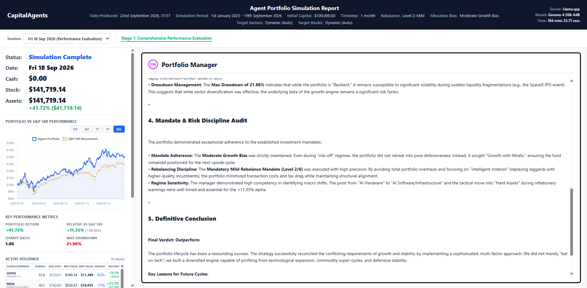

<p align="center">
  
</p>

<h1 align="center" padding="20px">CapitalAgents</h1>
  
   

## Overview

CapitalAgents is an AI financial advisor and portfolio management system. It deploys specialised LLM agents with distinct roles (Bull/Bear Analysts, Risk Analysts, Macro Strategists etc.) to score single equities, and create and rebalance entire portfolios in real-time or in backtested market simulations.

CapitalAgents pairs LLMs with real-world financial data from various pipelines (SEC Edgar, Alpaca, Finnhub, FRED, yfinance amongst others) and a Modern-FinBERT sentiment analysis engine optimised across hardware tiers (TensorRT, ONNX Runtime, and PyTorch) to provide accurate and timely insights into the U.S. financial markets.


## Installation

CapitalAgents includes an automated installer which inspects hardware, creates a virtual environment and installs the optimal inference engine. 

### 1. Clone the repository
```powershell
git clone https://github.com/harrym1008/Capital-Agents.git
cd Capital-Agents
```

### 2. Run the installer
```powershell
python install.py
```

Running `install.py` will:
1. Create a virtual environment in the `venv` folder
2. Install the required dependencies from `requirements-base.txt`
3. If an NVIDIA GPU is present: Installs PyTorch (`cu132`) and `onnxruntime-gpu`.
4. If no NVIDIA GPU: Installs PyTorch (`cpu`) and `onnxruntime`.
5. Downloads the pre-trained FP32 ONNX model directly from Hugging Face and saves it to the `finbert/models/` folder. The model can be found here: https://huggingface.co/harrym1008/ModernFinBERT-fp32-onnx/tree/main
6. Runs a warm-up verification test to ensure the Modern-FinBERT model is working correctly.


### 3. Download Market Data
Capital-Agents requires large amounts of historical market data to run backtested boardroom simulations and ratings without hitting API rate limits. You can download the required data inside a zip file from the following link: 

- **CapitalAgents Market Data**: [Download `CapitalAgents-data.zip` from GitHub (1.05 GB)](https://github.com/harrym1008/Capital-Agents/releases/tag/data)

Instructions for installation exist on that page in 'Releases'.


### 4. Configure API Keys
To populate data from real-time feeds after the `data.zip` cutoff date of 19th September 2026, you will need to configure certain API keys. The project has been designed around free-tier APIs that require **zero credit cards or paid credits or subscriptions**.

To do this, you must rename the `.env.example` to `.env` and fill in the required API keys. The following free APIs are supported:

| Environment Variable | Service | Requirements | Free Signup Link |
| :--- | :--- | :--- | :--- |
| `ALPACA_API_KEY` and `ALPACA_API_SECRET` | Alpaca | Up-to-date OHLCV quotes and news streams | [alpaca.markets](https://alpaca.markets) |
| `FRED_API_KEY` | Federal Reserve (FRED) | Free economic series (Bond yields, GDP, CPI, etc.) | [fred.stlouisfed.org](https://fred.stlouisfed.org/docs/api/api_key.html) |
| `FINNHUB_API_KEY` | FinnHub | Company profiles, metrics (P/E ratios, etc.) | [finnhub.io](https://finnhub.io) |
| `OPENROUTER_API_KEY` | OpenRouter | Cloud LLM access (required only if using OpenRouter; supports free models) | [openrouter.ai](https://openrouter.ai) |
| `MASSIVE_API_KEY` | Polygon / Massive | Free historical market data (optional; **only** needed if running `exec/mass_downloader.py`) | [polygon.io](https://polygon.io) |

If any of these API keys are not set, some company/market data may not be available, some features may not work and the LLM agents will make less accurate predictions.


### 5. Launch the Application

Activate the virtual environment and run the main application:

```powershell
# In Windows PowerShell:
.\venv\Scripts\Activate.ps1
python main.py
```

Open your browser and navigate to `http://localhost:9091` to access the CapitalAgents dashboard. Click the **Server Configuration** to configure the LLM server and model. For more information on this page and others in the dashboard, click the **Help from ChatGPT** button. Also, consider directly reading the documentation inside the `gptdocs` folder.


## Sentiment Engines
Sentiment analysis on financial news and SEC filings runs through ModernFinBERT (tabularisai/ModernFinBERT). The inference engine is chosen based on your hardware inside the `install.py` installation script. The following inference engines are supported, in hierarchical order of highest-to-lowest performance:

1. **TensorRT** (NVIDIA GPUs only, requires running `finbert_quantise.py` to quantise the FP32 model to FP8 - TensorRT 'engines' are built for your machine only and are not portable)
2. **ONNX GPU Runtime** (standard GPU acceleration using FP32 ONNX model)
3. **PyTorch GPU Runtime** (slightly slower GPU acceleration using FP32 PyTorch model)
4. **ONNX CPU Runtime** (FP32 ONNX model, CPU only, much slower than GPU inference)
5. **PyTorch CPU Runtime** (FP32 PyTorch model, CPU only, slowest inference engine)


## Screenshots

<p align="center">
  
  <br>
  <em>CapitalAgents Home Page</em>
</p>

<p align="center">
  
  <br>
  <em>CapitalAgents Single Equity Rating Boardroom Example</em>
</p>

<p align="center">
  
  <br>
  <em>CapitalAgents Portfolio Creation Example</em>
</p>

<p align="center">
  
  <br>
  <em>CapitalAgents Agent-Driven Portfolio Report Example</em>
</p>


## Acknowledgements
- **ModernFinBERT**: Developed by Tabularis AI ([tabularisai/ModernFinBERT](https://huggingface.co/tabularisai/ModernFinBERT)). Licensed under the Apache License 2.0.
- Built by Harrison McGrath as part of the CM3070 Final Project at the University of London. Licensed under the MIT License. See [LICENSE](LICENSE) for details.